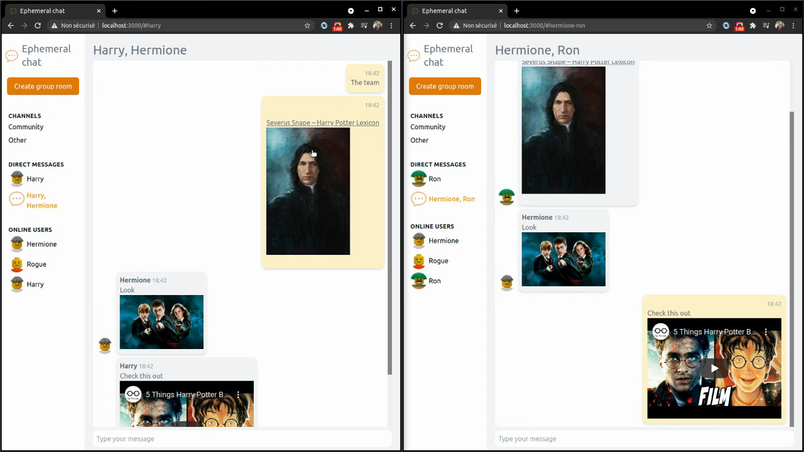

# Ephemeral chat

## The story

So, I was just reading the documentation of Socket.io and I decided to code a simple chat. Original, right :sweat_smile:. It was supposed to be a simple chat, but I decided to add some features. Honestly I did not think to add those features at the beginning, I would have definitely architecture my code differently but anyway, it is working and I do not want to spend too much time on it. It is "just a chat" and I have a lot of technologies to explore :smirk:. At least I have finnished the project, it is not always the case!

## Features
- Private (1-1), group conversations and channels
- Typing indicators
- Thumbnail generation
- Rich media preview
- Notifications

## Technologies

### [Socket.io](https://socket.io/)
The main purpose was to test Socket.io (preparation for another project I have in mind). 

### [Tailwindcss](https://tailwindcss.com/)
First time I am using tailwind. It was pretty handy and I am really happy with the framework. I will definitely use it in next projects.

### [Node.js](https://nodejs.org/) / [Express](https://expressjs.com/)
Of course, we need a server. I have also added a small API to fetch data if an user add an url to its message.

### Vanilla js
I thought it was funny to do it without library, it was just supposed to be a simple chat, remembered? Honestly it was a pain in the a**. 

I usually use React and try to organize my code properly according to my components but as I have started to put everything in a single file, it became a real mess. 
I am definitely not satisfied with the final code. It will encourage me to have a look to projects / tutorials / youtube videos where developers are not using frameworks.

## Assets
- Credits
<a target="_blank" href="undefined/icons/set/speech-bubble-with-dots">Chat Bubble icon</a> icon by <a target="_blank" href="">Icons8</a>

- [Random user](https://randomuser.me/) for the Lego logo